# 选择排序（Selection Sort）

/// success | 一句话解释

在 $i$ 到 $n-1$ 范围上，选出最小值并通过交换的方式放到 $i$ 位置上，然后再在 $i+1$ 到 $n-1$ 范围上继续。

///

## 一、算法图解

### 1.1 Manim 动画演示


/// details | Manim 动画演示源代码

```python { .blur hl_lines="77 78 80 82 84 89" }
"""Manim Animation for Selection Sort."""

from __future__ import annotations as _

from math import sqrt
from os import remove
from subprocess import run
from typing import override

from manim import *

GOLDEN_RATIO: float = (sqrt(5) - 1) / 2
RADIUS: float = (1 - GOLDEN_RATIO) / 4
OPACITY: float = (sqrt(5) + 1) / 4

FONT_CHINESE: str = "LXGW WenKai"
FONT_ENGLISH: str = "Comic Mono"

MIDDLE_GRAY: ManimColor = ManimColor.from_rgb((0.5, 0.5, 0.5))


class Manim(Scene):
    """A Scene is the canvas of my animation."""

    @override
    def setup(self) -> None:
        title = Text("选择排序", font=FONT_CHINESE, weight=BOLD, color=MIDDLE_GRAY)
        title.to_edge(UP)
        mark = Text("xiaokang2022.github.io", font=FONT_ENGLISH, font_size=18, color=MIDDLE_GRAY)
        mark.to_corner(DR)
        self.add(title, mark)

    @override
    def tear_down(self) -> None:
        self.wait()

    @override
    def construct(self) -> None:
        data = [4, 6, 3, 2, 7, 1, 5]

        bars = {
            i: (
                Text(
                    f"{v}",
                    font=FONT_ENGLISH,
                    font_size=32,
                    color=MIDDLE_GRAY,
                ),
                RoundedRectangle(
                    RADIUS,
                    fill_opacity=OPACITY,
                    width=GOLDEN_RATIO,
                    height=GOLDEN_RATIO*v,
                    fill_color=BLUE,
                    stroke_color=MIDDLE_GRAY,
                ),

            ) for i, v in enumerate(data)
        }

        for i, (value, rectangle) in bars.items():
            rectangle.move_to(np.array([i-(len(data)/2)+0.5, 0, 0]))
            rectangle.align_to(np.array([0, -2.5, 0]), DOWN)
            value.next_to(rectangle, UP)

            index = Text(
                f"{i}",
                font=FONT_ENGLISH,
                font_size=32,
                color=MIDDLE_GRAY,
            ).next_to(rectangle, DOWN)

            self.add(index, rectangle, value)

        self.wait()

        for i in range(length := len(data)):
            min_index = i
            self.play(bars[i][1].animate.set_fill(RED), run_time=GOLDEN_RATIO)
            for j in range(i + 1, length):
                self.play(bars[j][1].animate.set_fill(YELLOW), run_time=GOLDEN_RATIO)
                if data[j] < data[min_index]:
                    self.play(bars[min_index][1].animate.set_fill(BLUE), run_time=GOLDEN_RATIO)
                    min_index = j
                    self.play(bars[j][1].animate.set_fill(RED), run_time=GOLDEN_RATIO)
                else:
                    self.play(bars[j][1].animate.set_fill(BLUE), run_time=GOLDEN_RATIO)

            data[i], data[min_index] = data[min_index], data[i]

            animations = [m.animate.shift(RIGHT*(min_index-i)) for m in bars[i]]
            animations += [m.animate.shift(LEFT*(min_index-i)) for m in bars[min_index]]
            self.play(*animations, run_time=GOLDEN_RATIO)
            self.play(bars[min_index][1].animate.set_fill(GREEN), run_time=GOLDEN_RATIO)

            bars[i], bars[min_index] = bars[min_index], bars[i]


if __name__ == "__main__":
    config.format = "png"
    config.transparent = True

    Manim().render()

    PATH: str = ".\\media\\images"

    run(
        "ffmpeg "
        "-framerate 60 "
        f"-i {PATH}\\Manim%04d.png "
        "-c:v libwebp_anim "
        "-q 85 "
        "-compression_level 6 "
        "-loop 0 "
        "-preset text "
        "output.webp",
        shell=True,
        check=True,
    )

    frame = 0

    while True:
        try:
            remove(f"{PATH}\\Manim{frame:04d}.png")
        except FileNotFoundError:
            break
        frame += 1
```

///

### 1.2 Mermaid 流程图示意

```mermaid
graph TD
    A(("开始")) --> B[/"初始化数组 arr<br>n = len(arr)"/]
    B --> C["i = 0"]
    C --> D{i < n-1?}
    D -- 是 --> E["min_index = i<br>j = i+1"]
    E --> F{j < n?}
    F -- 是 --> G{"arr[j] < arr[min_index]?"}
    G -- 是 --> H["min_index = j"]
    H --> I["j += 1"]
    G -- 否 --> I
    I --> F
    F -- 否 --> J["交换元素<br>arr[i], arr[min_index]"]
    J --> K["i += 1"]
    K --> D
    D -- 否 --> L(("结束"))

    style A fill:#0F07,stroke:#7777
    style L fill:#F007,stroke:#7777
```



## 二、算法特性

### 2.1 时间复杂度

时间复杂度为 $O(n^2)$，~~不愧是“三傻”排序之一~~。

### 2.2 空间复杂度

空间复杂度为 $O(1)$，不消耗额外的空间，即原地排序。

### 2.3 其它性质

* 不稳定排序：无法保证相邻顺序不变；

## 三、算法实现

### 3.1 多语言代码

下面提供了多种语言的版本，仅供参考。在每种编程语言下方均提供了可视化代码，但加载可能稍慢，请耐心等待。

/// tab | 🔵 Python

```python hl_lines="4 7 8"
def selection_sort(arr: list[int]) -> None:
    """选择排序"""
    for i in range(len(arr)):
        min_index = i
        for j in range(i + 1, len(arr)):
            if arr[j] < arr[min_index]:
                min_index = j
        arr[i], arr[min_index] = arr[min_index], arr[i]
```

{% set src_python = "https://pythontutor.com/iframe-embed.html#code=def%20selection_sort%28arr%3A%20list%5Bint%5D%29%20-%3E%20None%3A%0A%20%20%20%20for%20i%20in%20range%28len%28arr%29%29%3A%0A%20%20%20%20%20%20%20%20min_index%20%3D%20i%0A%20%20%20%20%20%20%20%20for%20j%20in%20range%28i%20%2B%201,%20len%28arr%29%29%3A%0A%20%20%20%20%20%20%20%20%20%20%20%20if%20arr%5Bj%5D%20%3C%20arr%5Bmin_index%5D%3A%0A%20%20%20%20%20%20%20%20%20%20%20%20%20%20%20%20min_index%20%3D%20j%0A%20%20%20%20%20%20%20%20arr%5Bi%5D,%20arr%5Bmin_index%5D%20%3D%20arr%5Bmin_index%5D,%20arr%5Bi%5D%0A%0Aif%20__name__%20%3D%3D%20%22__main__%22%3A%0A%20%20%20%20arr%3A%20list%5Bint%5D%20%3D%20%5B4,%206,%203,%202,%207,%201,%205%5D%0A%20%20%20%20selection_sort%28arr%29%0A%20%20%20%20print%28*arr%29&cumulative=false&heapPrimitives=nevernest&mode=edit&origin=opt-frontend.js&py=311&rawInputLstJSON=%5B%5D&textReferences=false" %}

??? example "可视化代码 [`🔍全屏查看`]({{ src_python }}){target="_black"}"

    <iframe width="1080" height="540" frameborder="0" src="{{ src_python }}"></iframe>

///

/// tab | 🔴 C++

```cpp hl_lines="4 7 10"
// 选择排序
void selectionSort(std::vector<int> &arr) {
    for (int i = 0, minIndex; i < arr.size(); ++i) {
        minIndex = i;
        for (int j = i + 1; j < arr.size(); ++j) {
            if (arr[j] < arr[minIndex]) {
                minIndex = j;
            }
        }
        std::swap(arr[i], arr[minIndex]);
    }
}
```

{% set src_cpp = "https://pythontutor.com/iframe-embed.html#code=%23include%20%3Ciostream%3E%0A%23include%20%3Cutility%3E%0A%23include%20%3Cvector%3E%0A%0Avoid%20selectionSort%28std%3A%3Avector%3Cint%3E%20%26arr%29%20%7B%0A%20%20%20%20for%20%28int%20i%20%3D%200,%20minIndex%3B%20i%20%3C%20arr.size%28%29%3B%20%2B%2Bi%29%20%7B%0A%20%20%20%20%20%20%20%20minIndex%20%3D%20i%3B%0A%20%20%20%20%20%20%20%20for%20%28int%20j%20%3D%20i%20%2B%201%3B%20j%20%3C%20arr.size%28%29%3B%20%2B%2Bj%29%20%7B%0A%20%20%20%20%20%20%20%20%20%20%20%20if%20%28arr%5Bj%5D%20%3C%20arr%5BminIndex%5D%29%20%7B%0A%20%20%20%20%20%20%20%20%20%20%20%20%20%20%20%20minIndex%20%3D%20j%3B%0A%20%20%20%20%20%20%20%20%20%20%20%20%7D%0A%20%20%20%20%20%20%20%20%7D%0A%20%20%20%20%20%20%20%20std%3A%3Aswap%28arr%5Bi%5D,%20arr%5BminIndex%5D%29%3B%0A%20%20%20%20%7D%0A%7D%0A%0Aint%20main%28%29%7B%0A%20%20%20%20std%3A%3Avector%3Cint%3E%20arr%7B4,%206,%203,%202,%207,%201,%205%7D%3B%0A%20%20%20%20selectionSort%28arr%29%3B%0A%20%20%20%20for%20%28int%20%26i%20%3A%20arr%29%20%7B%0A%20%20%20%20%20%20%20%20std%3A%3Acout%20%3C%3C%20i%20%3C%3C%20'%20'%3B%0A%20%20%20%20%7D%0A%20%20%20%20std%3A%3Acout%20%3C%3C%20std%3A%3Aendl%3B%0A%20%20%20%20return%200%3B%0A%7D&codeDivHeight=400&codeDivWidth=350&cumulative=false&curInstr=0&heapPrimitives=nevernest&origin=opt-frontend.js&py=cpp_g%2B%2B9.3.0&rawInputLstJSON=%5B%5D&textReferences=false" %}

??? example "可视化代码 [`🔍全屏查看`]({{ src_cpp }}){target="_black"}"

    <iframe width="1080" height="540" frameborder="0" src="{{ src_cpp }}"></iframe>

///

/// tab | 🟠 Java

```java
public static void selectionSort(arr) {
    
}
```



??? example "可视化代码 [`🔍全屏查看`]({{ src_java }}){target="_black"}"

    <iframe width="1080" height="540" frameborder="0" src="{{ src_java }}"></iframe>

///

/// tab | 🟡 JavaScript

```javascript
```



??? example "可视化代码 [`🔍全屏查看`]({{ src_javascript }}){target="_black"}"

    <iframe width="1080" height="540" frameborder="0" src="{{ src_javascript }}"></iframe>

///

/// tab | 🟤 C

```c
```



??? example "可视化代码 [`🔍全屏查看`]({{ src_c }}){target="_black"}"

    <iframe width="1080" height="540" frameborder="0" src="{{ src_c }}"></iframe>

///

/// tab | 🟢 C#

```csharp
```

!!! failure "可视化代码"

    抱歉！[pythontutor](https://pythontutor.com/) 暂时还不支持 C# 的可视化！

///

/// tab | 🟣 Go

```go
```

!!! failure "可视化代码"

    抱歉！[pythontutor](https://pythontutor.com/) 暂时还不支持 Go 的可视化！

///

### 3.2 自我测试

下面是一个 Python 交互式环境，你可以在其中编写自己的代码进行一些测试。初次启动需要较长时间，请耐心等待！

/// tip | 交互式编程 [`🚀启动环境`](javascript:void(activate())) [<kbd style="float:right">⚡运行</kbd>](javascript:void(run()))

<div class="thebe-status"></div>

<pre data-executable>
%reset -f

def selection_sort(arr: list[int]) -> None:
    pass  # 请将代码写在这里

if __name__ == "__main__":
    arr: list[int] = [4, 6, 3, 2, 7, 1, 5]
    selection_sort(arr)
    print(*arr)
</pre>

///

[^1]: <https://www.bilibili.com/video/BV12P41147to/>
[^2]: <https://www.hello-algo.com/chapter_sorting/selection_sort/>
