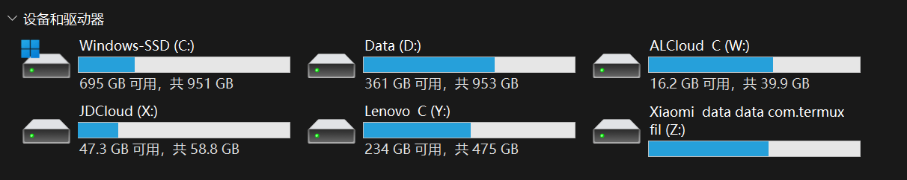

# 神器 Rclone：使用 SSH 或 SFTP 挂载任意远程目录到本地

有搞过云服务器的朋友肯定会经常在服务器与服务器之间，服务器与本地之间传输各种文件，但是传输文件非常麻烦，Windows Server 可以通过 Windows 自带的工具以 3389 端口进行远程桌面连接，传输文件稍微会方便一些，但对于 Linux，传输文件就稍显有些麻烦了。对于熟悉 Linux 的朋友来说当然其实无所谓，但对于 Linux 新手而言，这是一个比较麻烦的操作。

传输文件这么麻烦，要是可以像在本地磁盘之间传输文件就好了，诶，你还真别说，还真有个神器可以实现这个操作！

<!-- more -->

## 一、引言

### 1.1 前因后果

通过下面的文章，你将得到像下面的效果图：



/// figure-caption
Rclone 挂载目录到本地
///

图示中 ALCloud 是阿里云 Windows 服务器，JDCloud 是京东云 Linux 服务器（Ubuntu），Lenovo 是我另外一台 Windows 联想笔记本，Xiaomi 是我的小米手机……就问你酷不酷吧？

Xiaomi 我没搞 root 权限，所有很多东西无法访问，但也能凑合用。

前两个，是挂载的广域网中的云服务器，后面两个是局域网中的设备。不过此处的手机挂载方式不在此处详述，因为涉及到另外一个神器 Termux，将在后续文章中讲述。

### 1.2 操作需求

完成后续的操作，你将需要：

* 带有 Windows 操作系统的电脑；（理论上，其他操作系统也可以这样干，操作都差不多）
* 广域网挂载：云服务器（平台不限）；
* 局域网挂载：没有啥特殊要求；

## 二、挂载工具

### 2.1 挂载工具是什么

挂载工具一般是一个比较小的程序，可以实现将各类互联网的“类磁盘资源”作为“本地磁盘”挂载到本地，基本功能效果和本地磁盘一样，比如文件的移动、复制、粘贴、剪切和重命名等等，理论上，只要你的网速和服务器的网速足够快，使用起来就和本地磁盘没有任何区别！

### 2.2 挂载磁盘和网盘的区别

显而易见，网盘少有能够自动同步文件的功能，而且大多限速，挂载磁盘没有程序上的限速，限制的只有网速，而且它会几乎实时地对你的操作进行同步。你对挂载磁盘干了什么，对应的网络磁盘也会进行修改，不就相当于自动同步了吗？而且，挂载磁盘不需要额外再启动一个什么网盘客户端，启动脚本直接使用！

### 2.3 挂载工具有哪些

挂载工具有很多，但正因为其功能强大，大多数收费，比如知名的 RaiDrive 等，而且大多数都只对国外的网盘服务有完全的支持，对国内的只有部分支持（想完全支持就要收费）。国内的也有，比如 CloudDrive 等。国内也有一些免费的工具，但网上的风评都感觉不太好，什么底层会疯狂擦写磁盘来实现对应功能，导致影响磁盘寿命等等。还有一些不开源的工具，要注册账号啥的，感觉不太安全。因此，这里我选择开发时间相对较早，技术比较成熟，完全免费，完全开源的挂载工具神器 Rclone！

## 三、Rclone

### 3.1 为什么选择 Rclone

#### 3.1.1 Rclone 的优势

Rclone，开源，成熟，完全免费，对于国内外的都几乎全支持（有些功能需配合其他的工具），全平台可用（此处以 Windows 为例），社区活跃，长期维护，非联网工具（无需网络注册账号什么的）

#### 3.1.2 Rclone 的缺点

Rclone 这么好，为什么还有其他的挂载工具出现呢？因为 Rclone 有个唯一的缺点，没得图形界面，它的一切操作都是在终端中进行的……先别急着走，虽然这样，但你只要按照我下面的操作来，你几乎不需要做任何事情，复制粘贴代码回车运行就行！人人可能不都是程序员，但人人都可以成为一个合格甚至优秀的 CV 工程师（附：CV 指 ++ctrl+c++ 和 ++ctrl+v++）！

### 3.2 Rclone 下载

Rclone 建议在官方位置下载安装，即在其 GitHub 仓库找到文件：<https://github.com/rclone/rclone>

打开页面后，在右侧找到 Releases 字样，点击下面的 Latest 发行版进去就是当前官方的最新发行版文件了，找到下面的 Assets，里面有很多文件，都是适配不同操作系统的版本，对于一般的 Windows 用户而言，选择 rclone-vX.X.X-windows-amd64.zip 并等待下载完成就可以了（X 是版本号，amd 别看成 arm 了！）。这玩意儿，下载完解压后就行了，无需安装。

解压后的文件目录是这样的（版本 v1.66.0）：


Rclone
把它找个地方放起来，记住这个存放位置，后面我们（可能）还需要用到。

### 3.3 Winfsp 下载安装

这个仅对 Windows 用户有效。

有部分功能需要 Winfsp 这个小工具才能完成，此工具并非 Rclone 官方开发的，而是由另外一群人开发的，这里放出他们的 GitHub repo，下载操作和上面的 Rclone 类似（对应位置选择 msi 扩展名的文件就行），但是，这个是要安装的（双击下载的 msi 文件即可）。

Github repo：winfsp/winfsp: Windows File System Proxy - FUSE for Windows (github.com)

如果你使用 Rclone 的过程中没啥问题，那就不需要装这个了，等用某个功能时报了啥错再来安装这玩意儿也不迟。 

## 四、挂载服务器磁盘到本地

### 4.1 SSH

一定要确保服务器拥有 ssh-server 的功能，Linux 一般自带，部分 Windows Server 不自带，需要手动开启。因为我们的功能是通过 ssh/sftp 协议实现的，所以要保证服务器有这个功能。

理论上，还需要保证客户端（也就是本地）有 ssh-client，但一般都自带了，就不提了。一般来说，局域网挂载的时候，需要手动开启 ssh server，因为家庭版 Windows 默认是不开启的。

#### 4.1.1 手动开启 Windows ssh server 服务

控制面板 -> 程序 -> 程序和功能 -> 启用或关闭 Windows 功能（在界面左侧） -> openSSH Server（如果没开启这里就会有）。

安装后，打开 服务（终端输入 services 打开），找到上面说的这玩意儿，然后启动它（修改属性为自动比较好，防止关机后没有自己启动）。

### 4.2 本地配置挂载磁盘

找到我们存放 Rclone 的文件目录，在此文件夹中的空白位置打开右键菜单，点击在终端中打开（如果没有这一项，就自己手动打开终端，然后切换到该目录下），输入以下命令进行 Rclone 的配置：

```shell linenums="0"
rclone config
```

#### 4.2.1 添加服务器配置

添加服务器的步骤较多，根据每个人的需求而变，此处以阿里云轻量级 Windows 云服务器为例，Rclone 的版本为 1.66.0。如果你懂一些英文，实际不需要太多教学，自己也能摸索出来。

注意：部分 Windows Server 没有 openssh server 服务，需手动开启。

步骤 01

输入命令进入 rclone 配置模式：

```shell linenums="0"
rclone config
```

会出现下面几个选项：

```shell linenums="0"
e) Edit existing remote
n) New remote
d) Delete remote
r) Rename remote
c) Copy remote
s) Set configuration password
q) Quit config
e/n/d/r/c/s/q>
```

根据对应的英文，我们输入 n 来添加新的服务器配置。

步骤 02

输入 n 并回车之后，会出现下面的字样：

```shell linenums="0"
Enter name for new remote.
name>
```

意思是要我们输入挂载位置的名称，这个名称由我们自己定义，与实际的服务器没有关系，这个名称就是到时候挂载时显示的名称（建议使用英文名称，我用中文它崩了）。

步骤 03

输入后回车，他会出现一大堆红绿相间的选项：

```shell linenums="0"
 1 / 1Fichier
   \ (fichier)
 2 / Akamai NetStorage
   \ (netstorage)
 3 / Alias for an existing remote
   \ (alias)
 4 / Amazon S3 Compliant Storage Providers including AWS, Alibaba, ArvanCloud, Ceph, ChinaMobile, Cloudflare, DigitalOcean, Dreamhost, GCS, HuaweiOBS, IBMCOS, IDrive, IONOS, LyveCloud, Leviia, Liara, Linode, Minio, Netease, Petabox, RackCorp, Rclone, Scaleway, SeaweedFS, StackPath, Storj, Synology, TencentCOS, Wasabi, Qiniu and others
   \ (s3)
 5 / Backblaze B2
   \ (b2)
 6 / Better checksums for other remotes
   \ (hasher)
 7 / Box
   \ (box)
 8 / Cache a remote
   \ (cache)
 9 / Citrix Sharefile
   \ (sharefile)
10 / Combine several remotes into one
   \ (combine)
11 / Compress a remote
   \ (compress)
12 / Dropbox
   \ (dropbox)
13 / Encrypt/Decrypt a remote
   \ (crypt)
14 / Enterprise File Fabric
   \ (filefabric)
15 / FTP
   \ (ftp)
16 / Google Cloud Storage (this is not Google Drive)
   \ (google cloud storage)
17 / Google Drive
   \ (drive)
18 / Google Photos
   \ (google photos)
19 / HTTP
   \ (http)
20 / Hadoop distributed file system
   \ (hdfs)
21 / HiDrive
   \ (hidrive)
22 / ImageKit.io
   \ (imagekit)
23 / In memory object storage system.
   \ (memory)
24 / Internet Archive
   \ (internetarchive)
25 / Jottacloud
   \ (jottacloud)
26 / Koofr, Digi Storage and other Koofr-compatible storage providers
   \ (koofr)
27 / Linkbox
   \ (linkbox)
28 / Local Disk
   \ (local)
29 / Mail.ru Cloud
   \ (mailru)
30 / Mega
   \ (mega)
31 / Microsoft Azure Blob Storage
   \ (azureblob)
32 / Microsoft Azure Files
   \ (azurefiles)
33 / Microsoft OneDrive
   \ (onedrive)
34 / OpenDrive
   \ (opendrive)
35 / OpenStack Swift (Rackspace Cloud Files, Blomp Cloud Storage, Memset Memstore, OVH)
   \ (swift)
36 / Oracle Cloud Infrastructure Object Storage
   \ (oracleobjectstorage)
37 / Pcloud
   \ (pcloud)
38 / PikPak
   \ (pikpak)
39 / Proton Drive
   \ (protondrive)
40 / Put.io
   \ (putio)
41 / QingCloud Object Storage
   \ (qingstor)
42 / Quatrix by Maytech
   \ (quatrix)
43 / SMB / CIFS
   \ (smb)
44 / SSH/SFTP
   \ (sftp)
45 / Sia Decentralized Cloud
   \ (sia)
46 / Storj Decentralized Cloud Storage
   \ (storj)
47 / Sugarsync
   \ (sugarsync)
48 / Transparently chunk/split large files
   \ (chunker)
49 / Union merges the contents of several upstream fs
   \ (union)
50 / Uptobox
   \ (uptobox)
51 / WebDAV
   \ (webdav)
52 / Yandex Disk
   \ (yandex)
53 / Zoho
   \ (zoho)
54 / premiumize.me
   \ (premiumizeme)
55 / seafile
   \ (seafile)
Storage>
```

最后一行有个 “Storage” 字样，我们在其后面输入对应选项的数字即可。这些选项代表各种模式。

一般而言我们使用 SSH/SFTP，找到该选项的数字，输入并回车。SSH/SFTP 表示用 ssh 或者 sftp 进行连接并传输文件，是一种安全的网络传输协议。

步骤 04

选择模式之后，回车会显示下面的信息：

```shell linenums="0"
Option host.
SSH host to connect to.
E.g. "example.com".
Enter a value.
host>
```

这是要我们输入远程连接的地址，输入你要挂载文件对应的 IP 地址就行了。

步骤 05

之后它会要求你输入用户名（Linux 一般是 root，Windows 如果没设置，那一般是 Administrator）：

```shell linenums="0"
Option user.
SSH username.
Enter a string value. Press Enter for the default (XXX\xxx).
user>
```

步骤 06

之后会问你端口，这个一般不用管，端口用协议的默认值就行，直接回车。 

```shell linenums="0"
Option port.
SSH port number.
Enter a signed integer. Press Enter for the default (22).
port>
```

步骤 07

然后它会问你密码：

```shell linenums="0"
Option pass.
SSH password, leave blank to use ssh-agent.
Choose an alternative below. Press Enter for the default (n).
y) Yes, type in my own password
g) Generate random password
n) No, leave this optional password blank (default)
y/g/n>
```

这个看你自己的需求：

我反正是直接输入我服务器操作系统的密码了（按 y 输入自己的密码）。

步骤 08

之后它还会问你更多的可选选项，如 key_pem、key_file、key_file_pass、pubkey_file、key_use_agent、use_insecure_cipher、 disable_hashcheck 和 ssh 等。若是不懂，就直接回车，使用默认值即可。

一直到出现下面这个界面：

```shell linenums="0"
Edit advanced config?
y) Yes
n) No (default)
y/n>
```

这是在问你还需不需要配置高级选项。直接回车，不用配置（默认值就好）。

步骤 09

最后会出现这个：

```shell linenums="0"
Configuration complete.
Options:
- type: sftp
- host: xxx.xxx.xxx.xxx
Keep this "XXX" remote?
y) Yes this is OK (default)
e) Edit this remote
d) Delete this remote
y/e/d>
```

表示配置完毕了，选择选项 y，保留该配置。

步骤 10

回车输入 y 之后就会回到一开始的界面了，此时会出现已经弄好的服务器配置了：

```shell linenums="0"
Current remotes:

Name                 Type
====                 ====
XXX                  sftp

e) Edit existing remote
n) New remote
d) Delete remote
r) Rename remote
c) Copy remote
s) Set configuration password
q) Quit config
e/n/d/r/c/s/q>
```

可以退出这个程序了。

#### 4.2.2 挂载磁盘

再次从 rclone 所在文件夹下进入终端命令行，输入下面的命令就可以挂载服务器指定目录到本地磁盘了：

```shell linenums="0"
rclone mount ServerName:RemotePath TargetPath
```

成功后先别急着把终端窗口关闭，可以先按 Win + E 快捷键查看资源管理器中是否出现新的盘符，如果有，那么点进去看看，如果没有弹出任何报错，那说明你成功了。 

### 4.3 后台运行

由于上述终端不能关闭，一旦关闭就会使得挂载服务终止，于是我们需要写一个脚本让其自己在后台运行。

#### 4.3.1 后台启动挂载服务

对于 Windows 操作系统，我们可以使用下面的命令使 Rclone 后台运行：

```shell linenums="0"
@echo off
%1 start mshta vbscript:createobject("wscript.shell").run("""%~0"" ::",0)(window.close)&&exit
start /b 在这里输入你的第一条命令
start /b 在这里输入你的第二条命令
```

更多的命令，以此类推。 你可以将上面的代码修改成自己想要的，然后新建一个文本文档文件，保存代码到里面，并重命名文件的扩展名为 bat 类型。双击它就可以运行了。

#### 4.3.2 终止挂载服务

如果想终止，也很简单：

```shell linenums="0"
@echo off
taskkill /im rclone.exe /f
pause
```

和启动后台同样的操作，只不过代码改成了上面这样。

### 4.4 开机自启

或许你还有开机让其自动启动的需求，其实也很简单，我们可以把写好的脚本，放在指定目录下就行，但这里要注意一点，不能直接把 bat 脚本放过去，还要修改一下路径，把命令中原来的 rclone 改成：

文件路径\rclone.exe
不然系统会找不到 rclone 的位置。

对了，指定的目录是：C:\ProgramData\Microsoft\Windows\Start Menu\Programs\StartUp\

然后系统开机就会自动调用该脚本，就实现开机自启的功能了。

## 五、疑难及建议

### 5.1 一些建议

#### 5.1.1 建议不要开机自启

首先，开机自启这个会些微影响开机速度，影响不大，但是，这个脚本运行的时候会有一个黑框框在屏幕前一闪而过，让人有点不太舒适。此外，这个脚本的运行必须要联网，否则将会失败，你怎么就确定你开机的时候一定有网络连接呢？而且，如果你还连接了其它的存储设备，如 U 盘和移动硬盘，这个盘符岂不是会乱套了？

综上，我们应该在我们使用此功能的时候手动双击运行一下脚本，当然，如果你电脑基本每次都要使用该功能的话，那你还是让它开机自启吧，前面的话就当我没说……

#### 5.1.2 扩展操作

上述是广域网操作，也就是针对于云服务器，实际上，局域网内的也可以……比如在一台设备内访问多台设备内的文件（不限操作系统，比如 Windows 电脑和 Android 手机）。我就说这么多，你快去勇敢折腾一下吧！（坏笑）

#### 5.1.3 扩展建议

实际上 Rclone 配合其他工具还可以实现很多很大实用的黑科技，比如配合 docker 可以将阿里云盘挂载到本地磁盘！（别指望我会教学，我没研究过……），还可以将 OneDrive 挂载到本地，等等一些其他的网盘资源（这个网上一大把，自己百度去）。

### 5.2 部分疑难

#### 5.2.1 rclone 无法识别

很显然，极大概率是因为你没有将终端切换到当前目录下。在默认目录下，没有 rclone 文件，那么系统就会认为：“这个调用命令的人在乱讲些啥有的没的啊，我怎么听不懂啊”……

将目录切换至 rclone 文件所在的目录可能有助于解决问题。

#### 5.2.2 一堆报错，出现了 winfsp 字眼

winfsp 没有安装，或者 winfsp 安装不正确，去看看网上的教程吧。

#### 5.2.3 其它问题

别看了，我也不知道怎么回事，因为我没遇到过……
